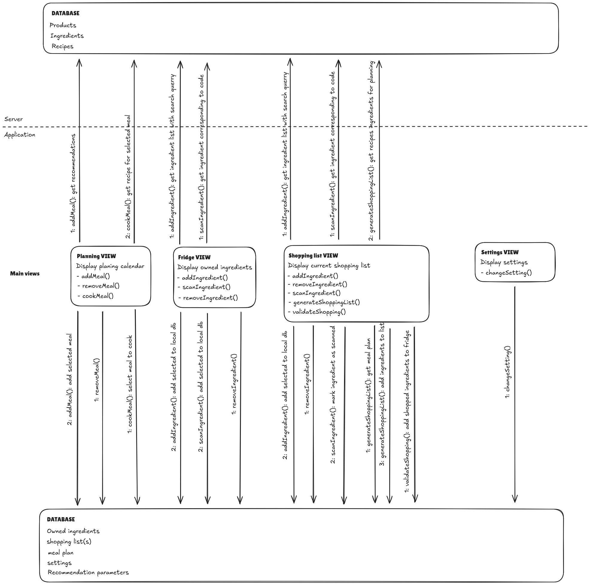

# Architecture

## Server

Stateless server responsible for handling the API endpoints which do simple read
operations in the database for most endpoints.  For the endpoints doc, see `doc/rest-api.md`. 

The server also handles the recommendation logic. There are two main recommendation
filters:
- What the user might like
- What is most practical for the user

## Application

The application holds all the state of the application in a sqlite database. This
database holds the `owned ingredients`, `meal plans`, `shopping lists`, `settings`
and data for recommendations which will depend on how we do the recommendation logic.

All views are there only to display the local database state and some data fetched
from the server. 

## Schema

